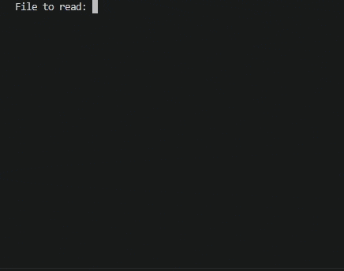

# 🍲 Recipe Search

A console-based recipe search application built in Java.

This application allows users to store and search recipes from a text file using different filters such as recipe name, cooking time, and ingredients.

Built as part of the Java Programming course by the University of Helsinki.
---
## 🎥 Demo


---

## 📌 Features

* List all recipes
* Search recipes by name
* Search recipes by cooking time
* Search recipes by ingredient
* Read recipe data from file
* Console-based user interface

---

## 🛠 Technologies

* Java
* Object-Oriented Programming (OOP)
* Maven
* File handling
* Collections and lists

---

## 📚 Concepts Practiced

* Class design
* User input handling
* File reading
* Data filtering
* Separation of responsibilities
* Console application structure

---

## ▶️ Running the Project

Compile and run using Maven:

```bash
mvn compile
mvn exec:java
```

---

## 🚀 What I Learned

This project helped me improve my understanding of object-oriented programming, file handling, and structuring Java console applications using multiple classes.
